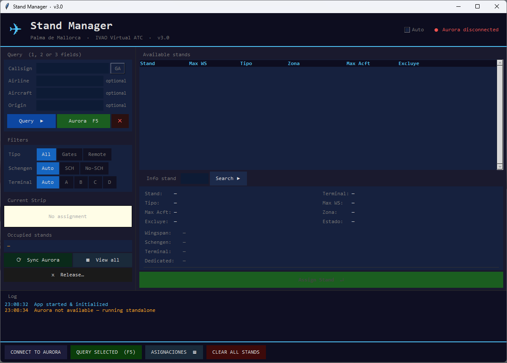

# GateManager

Herramienta de asignación de parkings y gates para ATC virtual en IVAO.
Introduce aerolínea, aeronave y aeropuerto de origen — GateManager te sugiere el stand más adecuado según terminal, envergadura y tipo de vuelo (Schengen / No Schengen).

> **v3** — Soporte multi-aeropuerto · Solo GUI · Sin CLI

[](https://github.com/Concara3443/gatemanager/releases/latest)
[](https://github.com/Concara3443/gatemanager/actions/workflows/ci.yml)
[](https://codecov.io/gh/Concara3443/gatemanager)

## Descarga rápida

**No tienes Python? Descarga el ejecutable directamente:**

👉 [Descargar GateManager.exe](https://github.com/Concara3443/gatemanager/releases/latest/download/GateManager.exe)

1. Descarga el `.exe`
2. Ejecútalo directamente — no requiere instalación ni Python

---

## Integración con Aurora (IVAO)

Si tienes Aurora abierto con "3rd Party" activado, GateManager puede:
- Leer automáticamente el plan de vuelo del tráfico seleccionado
- Enviar el gate asignado de vuelta a Aurora

### Conectar Aurora

Para que GateManager pueda comunicarse con Aurora es necesario activar el acceso de terceros:

1. En Aurora, ve a **PVD → Settings → Other → 3rd Party software access**
2. Activa la opción **Permitir**

> Para más detalles consulta el [Manual de usuario (PDF)](docs/manual_es.pdf).


---

## Capturas



| Panel de búsqueda | Resultados y asignaciones |
|---|---|
|  |  |


---

## Aeropuertos incluidos

| ICAO | Nombre | Terminales |
|------|--------|------------|
| LEBL | Barcelona El Prat | T1, T2, CARGO |
| LEPA | Palma de Mallorca | A, B, C, D, CARGO |

Añadir un nuevo aeropuerto es tan sencillo como crear una carpeta `airports/ICAO/` con tres archivos JSON. Ver [docs/ADDING_AN_AIRPORT.md](docs/ADDING_AN_AIRPORT.md).

---

## Requisitos

- Python 3.10 o superior
- Tkinter (incluido en la instalación estándar de Python)

---

## Cómo ejecutar

### Opción A — Ejecutable (sin Python)
1. Ve a [Releases](https://github.com/Concara3443/gatemanager/releases/latest)
2. Descarga `LEBL Parking.exe`
3. Ejecútalo — no requiere nada más

### Opción B — Con Python instalado

**Lanzador automático (recomendado):**
Doble clic en `iniciar_gui.vbs` — encuentra Python automáticamente y abre la app sin ventana de consola.

**Manual:**
```
python "LEBL Parking.pyw"
```

Al arrancar, si hay más de un aeropuerto disponible aparece un selector. Elige el aeropuerto y se abre la ventana principal.

---

## Compilar el ejecutable

```
compilar.bat
```

Genera `dist/LEBL Parking.exe` usando PyInstaller. Requiere `pip install pyinstaller`.


---

## Estructura del proyecto

```
gatemanager/
├── airports/
│   ├── LEBL/
│   │   ├── config.json       # terminales, mapa de dedicados
│   │   ├── airlines.json     # aerolíneas y sus terminales
│   │   └── parkings.json     # stands con envergadura, zona Schengen, etc.
│   └── LEPA/
│       └── ...
├── data/
│   ├── aircraft_wingspans.json   # base de datos global de envergaduras
│   ├── cargo_airlines.json       # aerolíneas cargo (asignadas automáticamente)
│   └── prefix_data.json          # prefijos OACI por país
├── app/
│   ├── core/airport.py           # carga y combina datos de un aeropuerto
│   ├── gui/app_window.py         # ventana principal
│   ├── parking_finder.py         # lógica de filtrado y asignación
│   ├── aurora_bridge.py          # integración con Aurora (IVAO)
│   ├── callsign_analyzer.py      # extrae aerolínea de un callsign
│   └── theme.py                  # paleta de colores y fuentes
├── assets/
│   └── splash.png
├── LEBL Parking.pyw              # punto de entrada
├── iniciar_gui.vbs               # lanzador para Windows
├── compilar.bat                  # script de compilación
└── lebl_parking.spec             # configuración PyInstaller
```

---

## Licencia

MIT — ver [LICENSE](LICENSE)
